

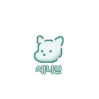

SSAFY 9기 자율 프로젝트

<b>"세상에 나쁜 보호자는 있다"</b>

 

&nbsp;  <a href="https://youtu.be/MqXQiv8_k_o">프로젝트 소개 UCC</a>

## :clipboard: 1. 프로젝트 소개
#### (1) 💡 기획 배경
반려동물을 키우는 가정이 늘어나며, 유기되는 동물의 수도 그만큼 늘어나고 있습니다. 
유기동물 보호 및 입양 시스템은 있지만, 유기 동물 발생을 줄일 수 있는 근본적인 해결책은 부족합니다. 
반려동물 양육자의 22.1%가 양육을 포기하거나, 파양을 고민해본 경험이 있다고 합니다.  
반려동물 유기의 가장 큰 원인은 <b>"사람들의 잘못된 지식, 준비되지 않은 자세"</b> 입니다.

#### (2) 📌 개발 목적
반려견 양육의 현실적인 어려움을 경험하고,
예비 보호자들의 양육 지식과 성숙한 태도를 확인하는 반려견 시뮬레이터

#### (3) 📆 제작 기간 및 인원

제작 기간 : 2023. 10.09 ~ 2023. 11. 17 (7주)  
참여 인원 : 6인

|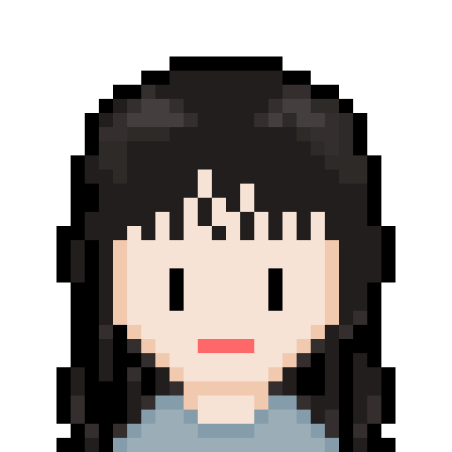||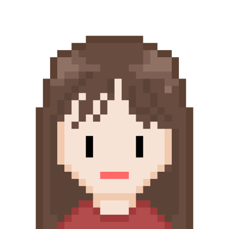|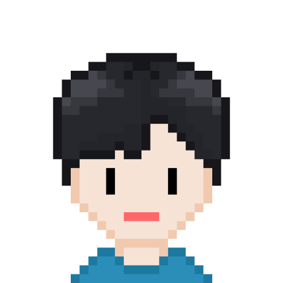|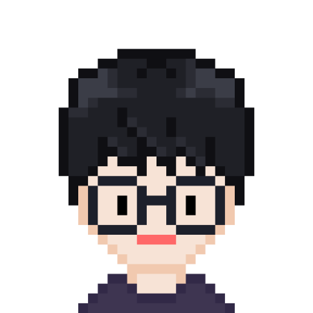|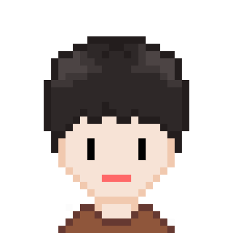|
|:--:|:--:|:--:|:--:|:--:|:--:|
|<a href="https://github.com/yooongeun?tab=repositories">김령은</a>|<a href="https://github.com/kimjaea">김재아</a>|<a href="https://github.com/zoeyvarnax">한라연</a>|<a href="https://github.com/soyeon37">함소연</a>|<a href="https://github.com/Jongwon97">이종원</a>|<a href="https://github.com/AtomicLiquors">최효빈</a>
|Unity 2D|Unity 2D|Unity 2D|Backend, CI/CD|Unity AR|Unity AR|
|UI/UX 기획 및 설계 Unity Asset 제작 애니메이션 구현 디버깅 및 리팩토링  서비스 발표|UI/UX 기획 및 설계 Unity Asset 제작 애니메이션 구현 디버깅 및 리팩토링|UI/UX 기획 및 설계 Unity Asset 제작 DB 및 API 설계 디버깅 및 리팩토링|UI/UX 기획 및 설계 Unity Asset 제작 DB 설계 및 API 개발 CI/CD 구축|AR 강아지 이동 구현 AR 돌발 이벤트 구현 GPS 활용 기능 구현 가속도계 활용 기능  구현|AR 애니메이션 구현 AR 유지보수성 향상 3D Asset 커스터 마이징 UCC 총괄제작|

## 🐾 2. 주요 기능
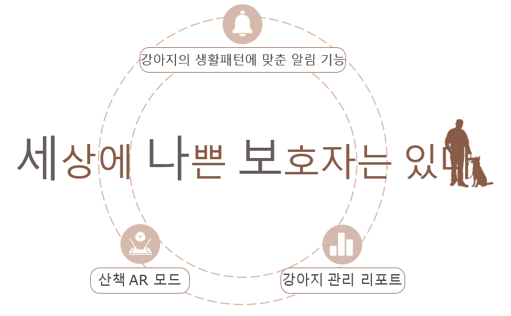

## 💻 3. 기술 스택
### Unity

### Backend

### CI/CD

## 4. 시스템 모식도 & ERD
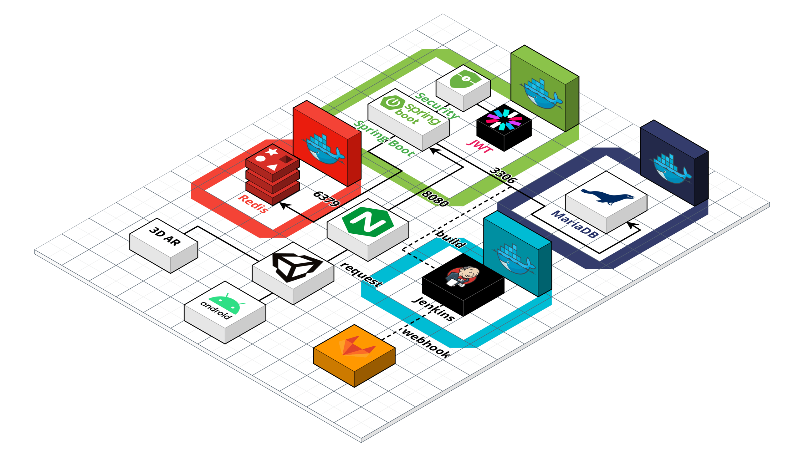
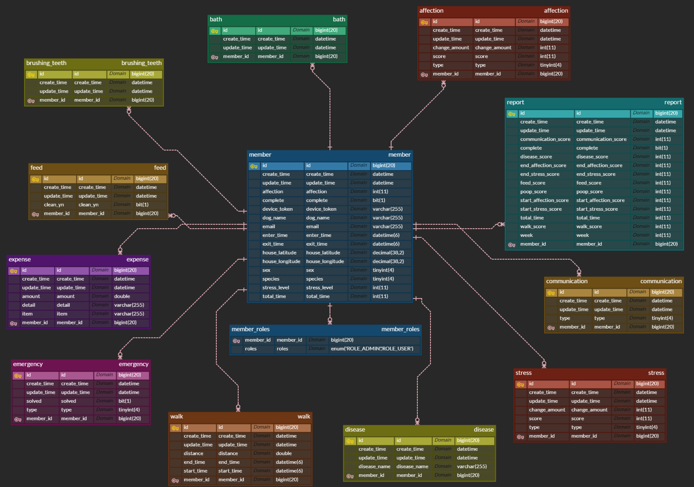

## 5. 2D 반려견 케어 서비스
#### (1) 반려견 케어
|밥 주기|목욕|교감|
|:--:|:--:|:--:|
|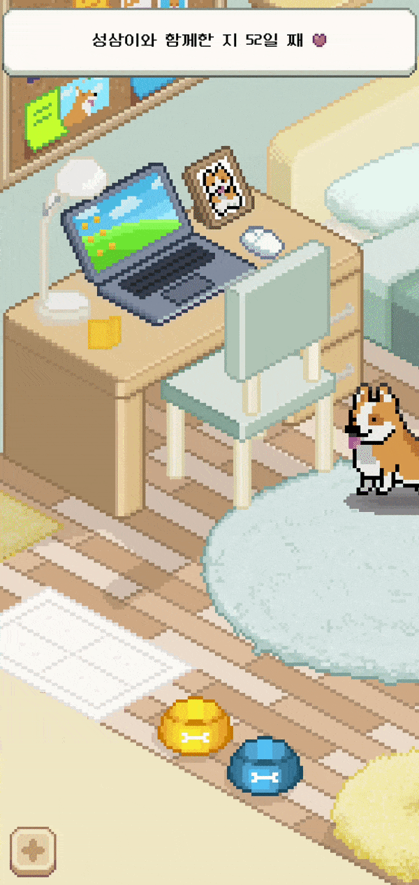||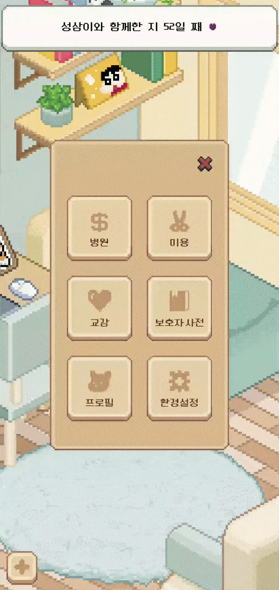|

#### (2) 반려견 상태 알림 및 돌발 이벤트
|상태 알림|돌발 이벤트|
|:--:|:--:|
|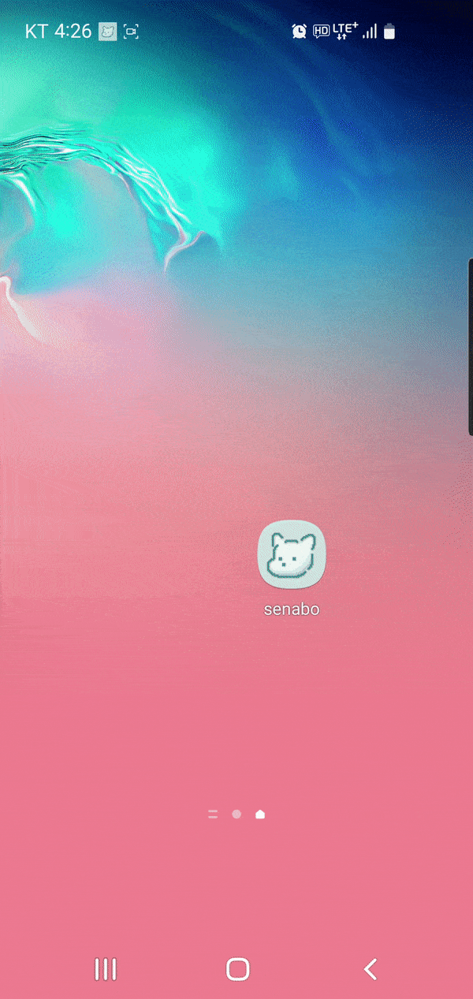|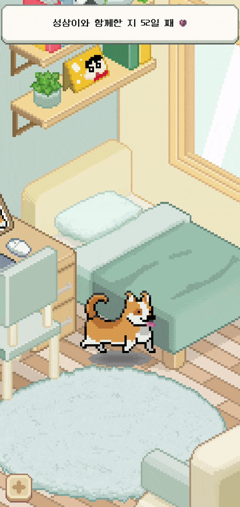|

#### (3) 리포트 제공
|주간 리포트|주간 리포트(세부 사항)|최종 리포트|비용|
|:--:|:--:|:--:|:--:|
|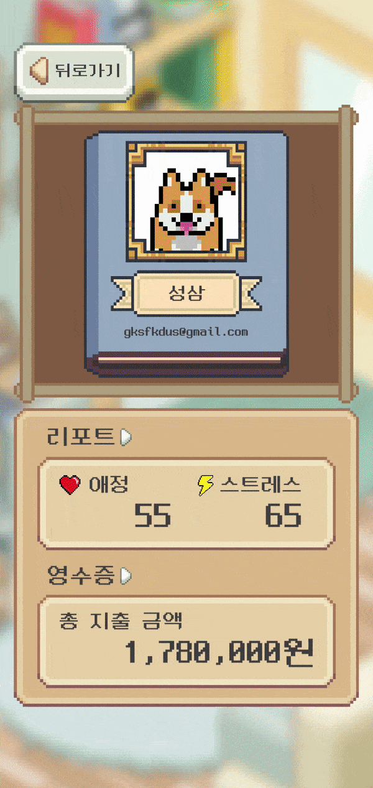|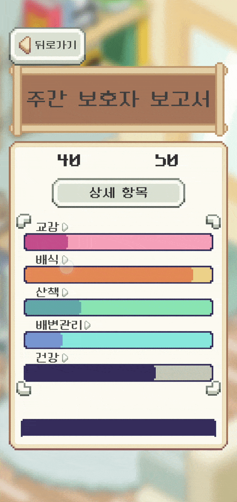||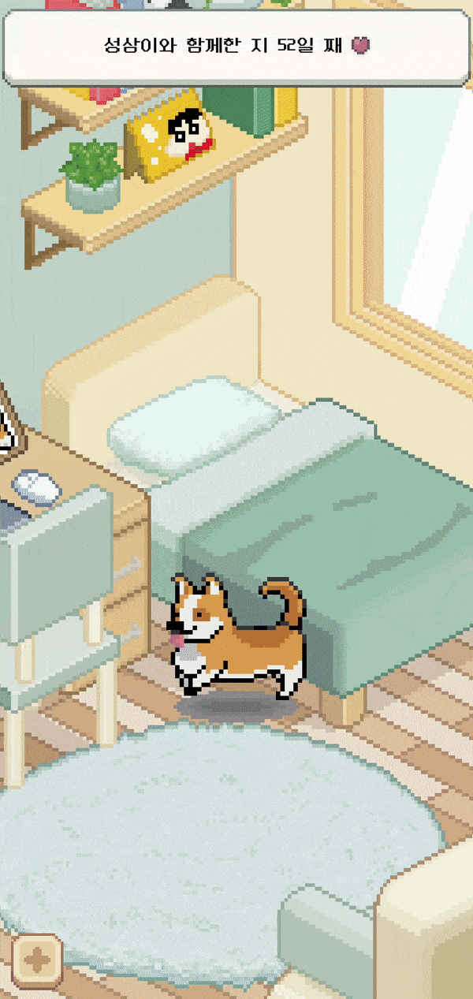|

## 6. AR 반려견 산책 서비스

#### (1) AR 강아지 이동
AR 산책이 시작되면 평면 인식 시스템이 동작하여 바닥을 인식 후, 새로운 평면을 인식하면 인식된 평면을 따라 강아지가 함께 이동한다.

|평면 인식|강아지 이동|
|:--:|:--:|
||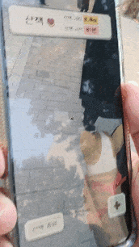|

#### (2) AR 돌발 이벤트
실제 반려견을 산책시키면서 일어날 수 있는 돌발 상황 구현. 
돌발 이벤트 발생 시 이벤트 해제 전 까지 휴대폰 진동이 울리면서 강아지가 움직이지 않는다.
|강아지가 주저 앉아서  움직이지 않을 때|산책 중 마주친  다른 강아지와 싸울때|바닥에 떨어진 이물질 섭취|
|:--:|:--:|:--:|
|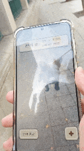|||
|간식을 줘서 강아지를 달래면  이벤트 해제|목줄을 당긴 후, 다른 강아지로부터  분리시키면 이벤트 해제|이물질을 주워먹기 전  목줄을 당겨 이벤트 해제
